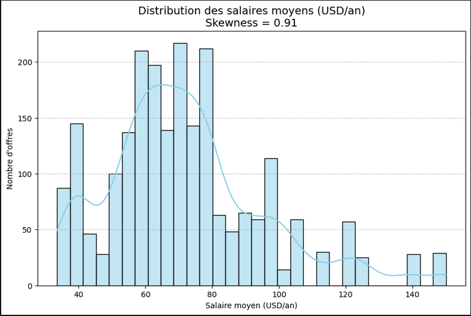
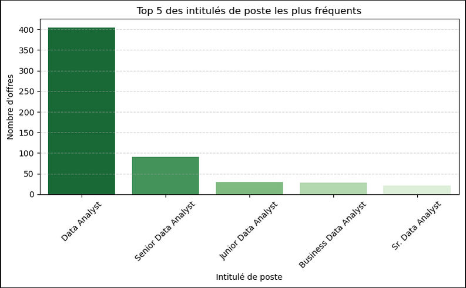

# 📊 Data Analyst Job Market Analysis (US)

Analysis of the Data Analyst job market in the United States using real-world job offer data.

---

## 🚀 Overview

This project explores job market trends for Data Analyst positions in the US by analyzing a dataset of job postings.

The objective is to extract actionable insights regarding:
- Salary distribution
- Most in-demand skills
- Job locations
- Experience requirements

---

## 💡 Key Insights

- Identification of the most demanded technical skills (Python, SQL, etc.)
- Analysis of salary ranges across different roles
- Geographic distribution of job opportunities
- Trends in experience requirements for Data Analyst roles

---

## 📊 Visualizations

The project includes multiple data visualizations to better understand the dataset:

- Salary distribution
- Skills frequency
- Job location distribution
- Experience level analysis

---

## 🛠️ Technologies Used

- Python  
- Pandas  
- NumPy  
- Matplotlib  
- Jupyter Notebook  

---

## 📁 Project Structure

data-analyst-job-market-analysis/  
│── data/  
│── notebook.ipynb  
│── images/  
│── README.md  

---

## 🎥 Demo

👉 Video presentation: https://youtu.be/DXJMUjGHAw8

---

## ⚙️ How to Run

git clone https://github.com/arthurb1348/data-analyst-job-market-analysis.git  
cd data-analyst-job-market-analysis  
pip install -r requirements.txt  
jupyter notebook

---

## 🎯 Purpose

This project was developed as part of my transition into Data Analysis, with a focus on:

Working with real-world datasets  
Performing exploratory data analysis (EDA)  
Extracting meaningful insights from data  
Communicating results through visualizations  

---

## 📌 Key Takeaway

Ability to transform raw job market data into structured insights that support decision-making.

---

## 🇫🇷 Version française

Ce projet consiste à analyser le marché de l’emploi des Data Analysts aux États-Unis à partir d’un dataset réel.
L’objectif est d’identifier les tendances clés (salaires, compétences, localisation, expérience) et de produire des visualisations permettant de mieux comprendre ce marché.
